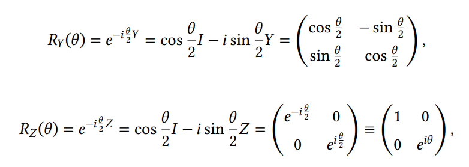
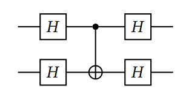

# Quantum Optimization

## 1 Foundations of Quantum Computing

### 1.1 Quantum computing: the big picture

say nothing

### 1.2 The basics of the quantum circuit model

> Every computation has three elements: data, operations, and output.


The three horizontal lines are  called wires, and they represent the three qubits.

The circuit is read from left to right, and on the left the qubits begin with $\Ket{0}$.

From left to right/top to bottom: Z,X,H,Y gate, two-qubit gate, three-qubit gate, two measure gates

After the measurements, the wires are represented with double lines, to indicate we have obtained a result—technically, we say that the state of the qubit has ==collapsed== to a classical value

### 1.3 Working with one qubit and the Bloch sphere

>the only matrices that we can use are the so-called unitary matrices

==Hadamard Gate== can create Superposition

X, Y, Z, H, I important gate

there's no any operation that allows us to distinguish $\Ket{\phi}$ and $c\Ket{\phi}$, we call $c$ a global phase

we can represent $\Ket{\phi}$ as:
$$
\Ket{\phi}=cos\frac{\theta}{2}\Ket{0}+sin\frac{\theta}{2}e^{i\Phi}\Ket{1}
$$
it gives us a three-dimensional point:
$$
(sin\theta cos\Phi,sin\theta sin\Phi,cos\theta)
$$

 >𝑋 gate acts like a rotation of 𝜋 radians around the 𝑋 axis of the Bloch sphere, the same to Y and Z

for the 𝑋, 𝑌 , and 𝑍 axes we may define:




it's clear that: $R_X(\pi)\equiv X,R_Y(\pi)\equiv Y,R_Z(\pi)\equiv Z,R_Z(\frac{\pi}{2})\equiv S,R_Z(\frac{\pi}{4})\equiv T$


==check exercise 1.8 later==

### 1.4 Working with two qubits and entanglement

we express a two-qubit states by ==tensor product==

it's worth mentioning that: 


here's an example, in the following circuit, the gate $𝑋 \otimes 𝑋$ acts on the two qubits and then it is followed by the gate $𝐻 \otimes 𝐼$,
where 𝐼 is the identity gate:


we have known the gate $CNOT$,

the control qubit is indicated by a solid black circle and the target qubit is indicated by the ⊕ symbol

 if we use the circuit:



we can apply a CNOT gate with target in the top qubit and control in the bottom one. It means the system is controlled by the second qubit, and if the second one is 1, the first qubit will be flipped.

> if a state can be written as the tensor product of  other two states, we can say it is not entangled
>
> if it's not a product state, we say that it is ==entangled==

==**The no-cloning theorem**==

It don't allow us to **copy information**, that means theres no such U existing:
$$
U\Ket{\phi}\Ket{0}=\Ket{\phi}\Ket{\phi}
$$

the ==controlled-U Gate== (CU)

the matrix is:


and the circuit looks like:


### 1.5 Working with multiple qubits and universality

we never mention inner product before, now let's talk about it briefly:
$$
(a_1 \enspace a_2 \enspace... a_{n-1} \enspace a_n)*(b_1 \enspace b_2 \enspace... b_{n-1} \enspace b_n)=(a_1b_1 \enspace a_2b_2 \enspace... a_{n-1}b_{n-1} \enspace a_nb_n)
$$
use Dirac notation, we get: 


where $a^*$ and $b^*$ are the complex conjugates of a and b 

> if we have 𝑛 qubits, the states that constitute the computational basis are: 


the matrix for the $CCNOT$ gate:


using it and with the help of auxiliary qubits, we can **construct any classical Boolean operator**

## 2 The Tools of the Trade in Quantum Computing

we use packege **"qiskit"**

>In Qiskit, circuits are represented as objects of the QuantumCircuit class

for example, we can run **"QuantumCircuit(n, m)"**, which means we have n qubits and m classical bits (classical bits are used to store the results of measurements)

Qubits and classical bits in Qiskit are grouped in quantum and classical registers. By default, when you create a circuit QuantumCircuit(n, m), Qiskit groups your qubits in a quantum register q and your bits in a classical register c.

but we can also create our own registers:

```python
qreg1 = QuantumRegister(size = 2, name = "qrg1")
qreg2 = QuantumRegister(1, "qrg2")
creg = ClassicalRegister(1, "oldschool")

qc = QuantumCircuit(qreg1, creg, qreg2)
```
**Notice**!

有代码的部分从此处开始尝试在jupyter notebook中运行

_**对量子电路的粗略理解：**_


在此图中，输入的量子比特从上至下为$\Ket{0}$和$\Ket{0}$，经过量子门后，输出的量子比特从上至下为$q1=H·X·\Ket{0}$和$q2=I·X·\Ket{1}$，而输出的两个qubits为：$\Ket{q1q2}=q1\otimes q2$

也可用此方法得到：$\Ket{q1q2}=(q1\otimes q2)·(X \otimes X)·(H \otimes I)$

即，“线”与“线”之间为内积

## 3 Working with Quadratic Unconstrained Binary Optimization Problems

here's an example of a graph:


Given a graph, the Max-Cut problem consists in finding a maximum cut of it

and here's two different cuts of the graph above:


(a) got 5 cuts and (b) got 4 cuts, while vertices 0, 1, 2 can not go in different sets, thus (a) is the Optimal cut

The details and the mathematical models of the Max-Cut problem and the **Ising Model** can be found in the file "SRTP_量子计算" P8-9.

An easy understanding: 


Here, we will write some code to work with those tensor products of 𝑍 matrices and to compute their expectation values, so let's get back to the "Note.ipynb" file

### 3.3 Moving from Ising to QUBO and back

Here we consider the **Subset Sum problem**


