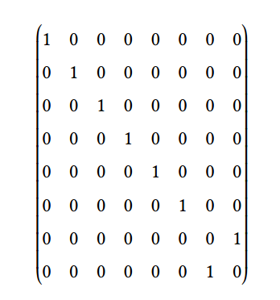

# Quantum Optimization

## 1 Foundations of Quantum Computing

### 1.1 Quantum computing: the big picture

say nothing

### 1.2 The basics of the quantum circuit model

> Every computation has three elements: data, operations, and output.

The three horizontal lines are  called wires, and they represent the three qubits.

The circuit is read from left to right, and on the left the qubits begin with $\Ket{0}$.

From left to right/top to bottom: Z,X,H,Y gate, two-qubit gate, three-qubit gate, two measure gates

After the measurements, the wires are represented with double lines, to indicate we have obtained a result—technically, we say that the state of the qubit has ==collapsed== to a classical value

### 1.3 Working with one qubit and the Bloch sphere

>the only matrices that we can use are the so-called unitary matrices

==Hadamard Gate== can create Superposition

X, Y, Z, H, I important gate

there's no any operation that allows us to distinguish $\Ket{\phi}$ and $c\Ket{\phi}$, we call $c$ a global phase

we can represent $\Ket{\phi}$ as:
$$
\Ket{\phi}=cos\frac{\theta}{2}\Ket{0}+sin\frac{\theta}{2}e^{i\Phi}\Ket{1}
$$
it gives us a three-dimensional point:
$$
(sin\theta cos\Phi,sin\theta sin\Phi,cos\theta)
$$

 >𝑋 gate acts like a rotation of 𝜋 radians around the 𝑋 axis of the Bloch sphere, the same to Y and Z

for the 𝑋, 𝑌 , and 𝑍 axes we may define:

it's clear that: $R_X(\pi)\equiv X,R_Y(\pi)\equiv Y,R_Z(\pi)\equiv Z,R_Z(\frac{\pi}{2})\equiv S,R_Z(\frac{\pi}{4})\equiv T$

==check exercise 1.8 later==

### 1.4 Working with two qubits and entanglement

we express a two-qubit states by ==tensor product==

it's worth mentioning that: 

here's an example, in the following circuit, the gate $𝑋 \otimes 𝑋$ acts on the two qubits and then it is followed by the gate $𝐻 \otimes 𝐼$,
where 𝐼 is the identity gate:

we have known the gate $CNOT$,

the control qubit is indicated by a solid black circle and the target qubit is indicated by the ⊕ symbol

 if we use the circuit:

we can apply a CNOT gate with target in the top qubit and control in the bottom one. It means the system is controlled by the second qubit, and if the second one is 1, the first qubit will be flipped.

> if a state can be written as the tensor product of  other two states, we can say it is not entangled
>
> if it's not a product state, we say that it is ==entangled==

==**The no-cloning theorem**==

It don't allow us to **copy information**, that means theres no such U existing:
$$
U\Ket{\phi}\Ket{0}=\Ket{\phi}\Ket{\phi}
$$

the ==controlled-U Gate== (CU)

the matrix is:

and the circuit looks like:

### 1.5 Working with multiple qubits and universality

we never mention inner product before, now let's talk about it briefly:
$$
(a_1 \enspace a_2 \enspace... a_{n-1} \enspace a_n)*(b_1 \enspace b_2 \enspace... b_{n-1} \enspace b_n)=(a_1b_1 \enspace a_2b_2 \enspace... a_{n-1}b_{n-1} \enspace a_nb_n)
$$
use Dirac notation, we get: 

where $a^*$ and $b^*$ are the complex conjugates of a and b 

> if we have 𝑛 qubits, the states that constitute the computational basis are: 

the matrix for the $CCNOT$ gate:

using it and with the help of auxiliary qubits, we can **construct any classical Boolean operator**

## 2 The Tools of the Trade in Quantum Computing

